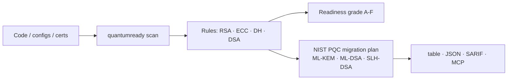

<a name="top"></a>
<div align="center">


# quantumready

### Scan any codebase/config for **quantum-vulnerable crypto** and get a NIST-PQC migration plan. Q-Day is coming — know your exposure.

[](LICENSE)   [](https://github.com/cognis-digital/cognis-neural-suite)

`#post-quantum` `#pqc` `#cryptography` `#ml-kem` `#security` `#harvest-now-decrypt-later`

</div>

"Harvest now, decrypt later" is real. `quantumready` finds **RSA / ECC / DH / DSA** usage that a quantum computer breaks, grades your **PQC readiness (A–F)**, and maps each finding to the NIST standards: **ML-KEM (FIPS 203)**, **ML-DSA (FIPS 204)**, **SLH-DSA (FIPS 205)**.

## Usage — step by step

1. Install the CLI (console-script: `quantumready`):
   ```bash
   pipx install "git+https://github.com/cognis-digital/quantumready.git"
   quantumready --version
   ```
2. Scan a codebase for post-quantum exposure (RSA/ECC vs NIST FIPS 203/204/205):
   ```bash
   quantumready scan ./src
   ```
3. Get machine-readable output for dashboards or SBOM-style tracking:
   ```bash
   quantumready scan ./src --format json > pq-report.json
   jq '.findings[] | select(.severity=="critical")' pq-report.json
   ```
4. Emit **SARIF 2.1.0** for GitHub code scanning / Azure DevOps / any SAST dashboard:
   ```bash
   quantumready scan ./src --format sarif > quantumready.sarif
   # then upload via github/codeql-action/upload-sarif (see demos/10-ci-gate)
   ```
5. Read the report — review flagged algorithms and their migration guidance.
6. In CI, gate the build on a severity threshold (non-zero exit when met):
   ```bash
   quantumready scan ./src --fail-on high
   ```

## Install (every way)
```bash
pip install "git+https://github.com/cognis-digital/quantumready.git"   # or pipx / uv tool install
curl -fsSL https://raw.githubusercontent.com/cognis-digital/quantumready/main/install.sh | sh
docker run --rm ghcr.io/cognis-digital/quantumready --help
```

## Use
```bash
quantumready scan .                    # grade your repo's PQC readiness
quantumready scan . --format json      # machine-readable
quantumready scan . --format sarif     # SARIF 2.1.0 (GitHub code scanning)
quantumready scan . --fail-on high     # CI gate
```

## Demos — real-use scenarios
Each [`demos/`](demos) folder has an input file in a **real** format plus a `SCENARIO.md`
(where the data came from, what to expect, the exact command, how to act):

| # | Scenario | Input format |
|---|----------|--------------|
| [01](demos/01-basic) | Basic source scan (start here) | Python |
| [02](demos/02-tls-nginx) | TLS termination audit | nginx.conf |
| [03](demos/03-openssh-config) | SSH bastion hardening | sshd_config |
| [04](demos/04-python-pki) | Token-signing microservice | Python (`cryptography`) |
| [05](demos/05-weak-rsa-legacy) | EOL device — undersized/legacy crypto | device config |
| [06](demos/06-pqc-hybrid-ready) | PQC-hybrid target state (grade A) | TLS policy YAML |
| [07](demos/07-java-keystore) | JVM service tier | Spring `application.properties` |
| [08](demos/08-x509-inventory) | Fleet certificate inventory | X.509 CSV export |
| [09](demos/09-vpn-ipsec) | Site-to-site VPN | strongSwan `ipsec.conf` |
| [10](demos/10-ci-gate) | CI gate + SARIF upload | Go + GitHub Actions |
| [11](demos/11-feed-enrichment) | KEV/NVD enrichment — exploited-now crypto CVEs (offline) | Python + live feeds |

## Feed enrichment — exploited-in-the-wild crypto CVEs (edge / air-gap)

A PQC migration is multi-year. What do you patch **first**? `quantumready` answers
that by cross-referencing the crypto your scan detects against two authoritative,
**keyless** intelligence feeds, then re-serving them **offline** for edge/air-gapped use:

| Feed id | Source | URL |
|---------|--------|-----|
| `cisa-kev` | CISA Known Exploited Vulnerabilities (actively-exploited CVEs) | https://www.cisa.gov/sites/default/files/feeds/known_exploited_vulnerabilities.json |
| `nvd-cve` | NIST National Vulnerability Database (CVE API 2.0) | https://services.nvd.nist.gov/rest/json/cves/2.0 |

**The enrichment (not cosmetic):** for each quantum-vulnerable family the scanner
finds (RSA / ECC / DH / DSA), it pulls the relevant NVD CVEs and intersects them
with the CISA-KEV catalog — surfacing the crypto weaknesses attackers are
exploiting **today** that you must patch before/while migrating to NIST PQC.

```bash
quantumready feeds list                       # the 2 feeds this tool consumes
quantumready feeds update                      # fetch + cache (keyless HTTPS)
quantumready feeds get cisa-kev --offline      # re-serve from cache, no network
quantumready scan ./src --enrich               # scan + KEV/NVD cross-reference
quantumready scan ./src --enrich --offline     # same, fully offline (air-gap)
```

### Air-gap / sneakernet workflow

The bundled `datafeeds` module is pure stdlib (urllib only): keyless HTTPS fetch →
disk cache (`COGNIS_FEEDS_CACHE`, default `~/.cache/cognis-feeds`) → `--offline`
re-serve. Move a cache snapshot into a disconnected enclave:

```bash
# connected host
quantumready feeds update
python -m quantumready.datafeeds snapshot-export feeds.tar.gz
# air-gapped enclave
python -m quantumready.datafeeds snapshot-import feeds.tar.gz
quantumready scan code/ --enrich --offline
```

Defensive / authorized-use intelligence only.

## Architecture


## Related
[🔐 agentpassport](https://github.com/cognis-digital/agentpassport) · [🧪 SecOps tools](https://github.com/cognis-digital/cognis-neural-suite) · [🗂️ the suite](https://github.com/cognis-digital/cognis-neural-suite)

> ### ⭐ Star it — start your PQC migration before Q-Day.

## Interoperability

`quantumready` composes with the 300+ tool Cognis suite — JSON in/out and a shared
OpenAI-compatible `/v1` backbone. See **[INTEROP.md](INTEROP.md)** for the
suite map, composition patterns, and reference stacks.

## Integrations

Forward `quantumready`'s findings to STIX/MISP/Sigma/Splunk/Elastic/Slack/webhooks via
[`cognis-connect`](https://github.com/cognis-digital/cognis-connect). See **[INTEGRATIONS.md](INTEGRATIONS.md)**.

## License
COCL v1.0 — see [LICENSE](LICENSE).
