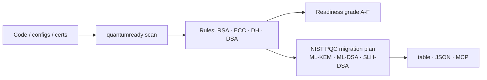

<a name="top"></a>
<div align="center">


# quantumready

### Scan any codebase/config for **quantum-vulnerable crypto** and get a NIST-PQC migration plan. Q-Day is coming — know your exposure.

[](LICENSE)   [](https://github.com/cognis-digital/cognis-neural-suite)

`#post-quantum` `#pqc` `#cryptography` `#ml-kem` `#security` `#harvest-now-decrypt-later`

</div>

"Harvest now, decrypt later" is real. `quantumready` finds **RSA / ECC / DH / DSA** usage that a quantum computer breaks, grades your **PQC readiness (A–F)**, and maps each finding to the NIST standards: **ML-KEM (FIPS 203)**, **ML-DSA (FIPS 204)**, **SLH-DSA (FIPS 205)**.

## Install (every way)
```bash
pip install "git+https://github.com/cognis-digital/quantumready.git"   # or pipx / uv tool install
curl -fsSL https://raw.githubusercontent.com/cognis-digital/quantumready/main/install.sh | sh
docker run --rm ghcr.io/cognis-digital/quantumready --help
```

## Use
```bash
quantumready scan .                    # grade your repo's PQC readiness
quantumready scan . --format json      # machine-readable
quantumready scan . --fail-on high     # CI gate
```

## Architecture


<a name="verification"></a>
## Verification

[](AUDIT.md)

Every push is verified end-to-end. Latest audit (2026-06-13):

```text
tests        : 1 passed, 0 failed, 0 errored
compile      : all modules parse
cli          : C:\Python314\python.exe: No module named https
package      : https
```

<details><summary>CLI surface (<code>--help</code>)</summary>

```text
C:\Python314\python.exe: No module named https
```
</details>

Full machine-readable results: [`AUDIT.md`](AUDIT.md) · regenerate with `python -m https --help` + `pytest -q`.

<div align="right"><a href="#top">↑ back to top</a></div>


## Related
[🔐 agentpassport](https://github.com/cognis-digital/agentpassport) · [🧪 SecOps tools](https://github.com/cognis-digital/cognis-neural-suite) · [🗂️ the suite](https://github.com/cognis-digital/cognis-neural-suite)

> ### ⭐ Star it — start your PQC migration before Q-Day.

## License
COCL v1.0 — see [LICENSE](LICENSE).
